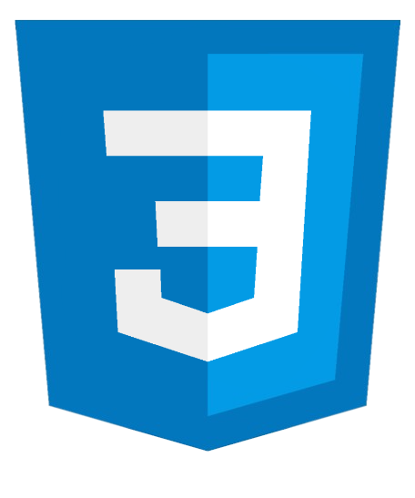

<h1 align="center">Hi there, I'm Adrien D'acunto 👋</h1>

 
  
 
 
 

- 👀 I'm a software developer specialising in web development using React, Angular and NextJS
- 🔭 I’m currently looking for a job
- 🌱 I’m currently practicing and building projects with React, Angular and NextJS.

## 🔨 Technical Stack

**Front-end** :
- React 
- Angular 
- NextJS 
- HTML 
- CSS 
- Javascript 
- Typescript 

**Back-end** : 
- PHP 
- Java 
- C# 
- SQL (MySQL) 
- NoSQL (MongoDB, Cosmos DB) 
- Express 

**Cloud Computing** :
- Firebase 
- Azure 

**Monitoring** :
- Grafana 

**Tools** :
- Visual Studio Code 
- Jira 
- Zoho 
- Git 
- Github 
- Docker 
  
## ✉️ Contact me

For jobs opportunities :

- Email me at [adrien.dacunto@limayrac.fr](mailto:adrien.dacunto@limayrac.fr).
- Send me a message via [LinkedIn](https://www.linkedin.com/in/adriendacunto/).
